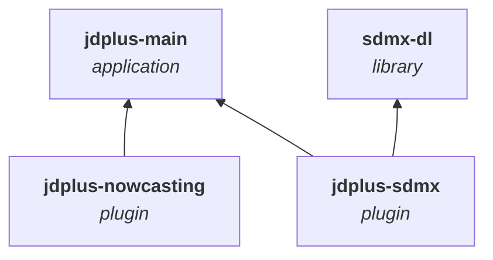
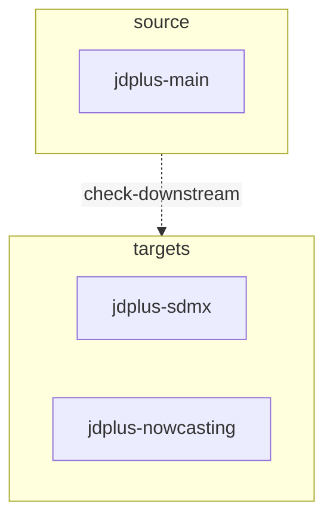
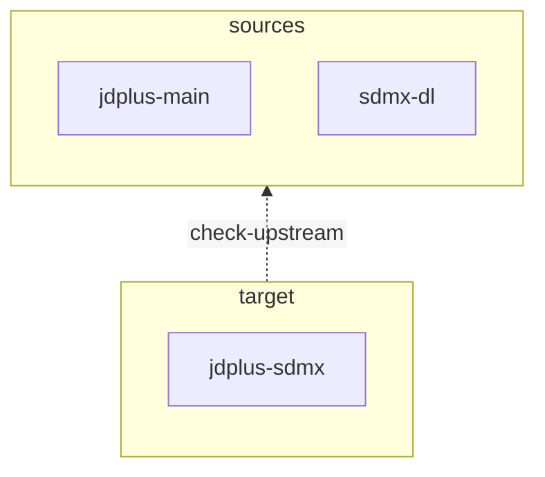

# compatibility-maven-plugin

Compatibility is a Maven plugin that checks the compatibility between projects.

Its main use case is when a library/application has extensions/plugins developed outside the main repository, the
developers need to ensure that everything stays compatible. A minor modification on one side may trigger a major problem
on the other side.

The main purpose of this plugin is to automate the compatibility check as much as possible to catch problems as early as possible.

## Usage

Dependency graph of the examples used in this document:


### check-downstream



With a pom file:

```xml
<plugin>
    <groupId>com.github.nbbrd.nbbrd-maven-tools</groupId>
    <artifactId>compatibility-maven-plugin</artifactId>
    <executions>
        <execution>
            <phase>validate</phase>
            <goals>
                <goal>check-downstream</goal>
            </goals>
            <configuration>
                <source>https://github.com/jdemetra/jdplus-main</source>
                <sourceBinding>eu.europa.ec.joinup.sat</sourceBinding>
                <sourceRef>v3.4.0</sourceRef>
                <targets>https://github.com/nbbrd/jdplus-sdmx,https://github.com/jdemetra/jdplus-nowcasting</targets>
                <targetLimits>1,1</targetLimits>
            </configuration>
        </execution>
    </executions>
</plugin>
```

Without a pom file (standalone mode):

```bash
mvn com.github.nbbrd.nbbrd-maven-tools:compatibility-maven-plugin::check-downstream \
  -D "compatibility.source=https://github.com/jdemetra/jdplus-main" \
  -D "compatibility.sourceBinding=eu.europa.ec.joinup.sat" \
  -D "compatibility.sourceRef=v3.4.0" \
  -D "compatibility.targets=https://github.com/nbbrd/jdplus-sdmx,https://github.com/jdemetra/jdplus-nowcasting" \
  -D "compatibility.targetLimits=1,1"
```

### check-upstream


With a pom file:

```xml
<plugin>
    <groupId>com.github.nbbrd.nbbrd-maven-tools</groupId>
    <artifactId>compatibility-maven-plugin</artifactId>
    <executions>
        <execution>
            <phase>validate</phase>
            <goals>
                <goal>check-upstream</goal>
            </goals>
            <configuration>
                <sources>https://github.com/jdemetra/jdplus-main,https://github.com/nbbrd/sdmx-dl</sources>
                <sourceBindings>eu.europa.ec.joinup.sat,com.github.nbbrd.sdmx-dl</sourceBindings>
                <sourceLimits>1,1</sourceLimits>
                <target>https://github.com/nbbrd/jdplus-sdmx</target>
                <targetRef>v3.3.0</targetRef>
            </configuration>
        </execution>
    </executions>
</plugin>
```

Without a pom file (standalone mode):

```bash
mvn com.github.nbbrd.nbbrd-maven-tools:compatibility-maven-plugin::check-upstream \
  -D "compatibility.sources=https://github.com/jdemetra/jdplus-main,https://github.com/nbbrd/sdmx-dl" \
  -D "compatibility.sourceBindings=eu.europa.ec.joinup.sat,com.github.nbbrd.sdmx-dl" \
  -D "compatibility.sourceLimits=1,1" \
  -D "compatibility.target=https://github.com/nbbrd/jdplus-sdmx" \
  -D "compatibility.targetRef=v3.3.0"
```

### split-job

Without a pom file (standalone mode):

```bash
mvn com.github.nbbrd.nbbrd-maven-tools:compatibility-maven-plugin::split-job \
  -D "compatibility.jobFile=job.json" \
  -D "compatibility.workingDir=./jobs"
```

### merge-reports

Without a pom file (standalone mode):

```bash
mvn com.github.nbbrd.nbbrd-maven-tools:compatibility-maven-plugin::merge-reports \
  -D "compatibility.reports=r1.json,r2.json" \
  -D "compatibility.reportFile=merged.md"
```

## Troubleshooting

**Unknow error at runtime**:  
Run the plugin with `-X` option to enable debug mode.

**Filename too long exception**:  
Run the plugin with the `compatibility.workindDir` parameter set to a shorter path.
